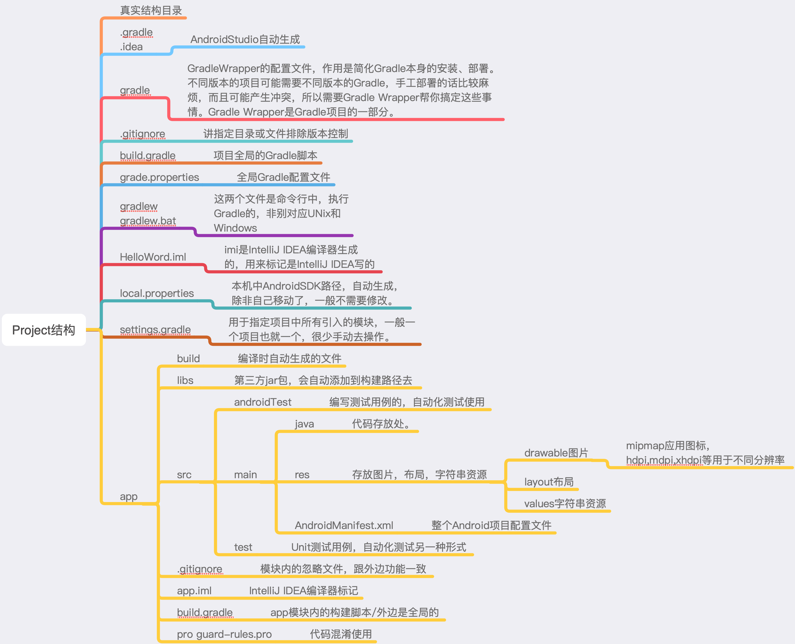
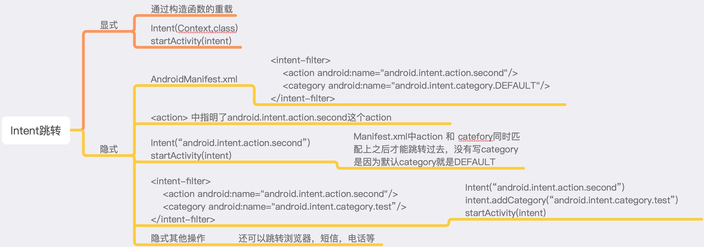
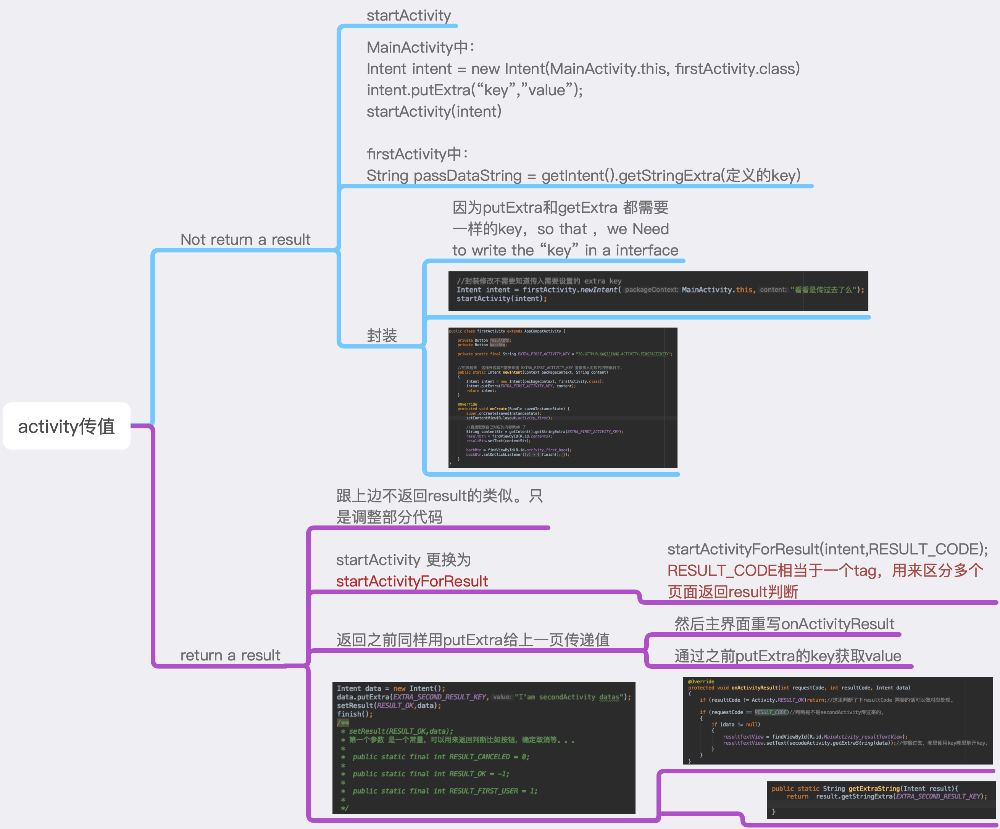

# AndroidProgram权威指南 androidTips
安卓项目，慢慢学开发。看书过程中，以自己的理解把书上的代码敲一边，加深理解，小本本，烂笔头。

## 1.Hello Word
- - - -

#### 主要内容
- AndroidManifest.xml 文件中 标记了主Activity
- MainActiviyt  文件中 继承自AppComoatAvtivity,重写了onCreate的系统方法。  
- 调用了setContentView(R.layout.activity_main) 调用了MainActivity
对应的布局文件，加载布局。
- 这样helloWord就显示出来了。

- - - -

## 2.Intent Jump
- - - -

#### 主要内容
- 利用Intent进行跳转
- 显式
- 隐式
- 系统默认跳转 浏览器 电话等

- - - -

## 3.ActivityPassData
- - - -

#### 主要内容
- 利用Intent进行跳转传值
- 只传递不返回结果
- 有返回结果同时传值
- putExtra封装，getExtra封装

